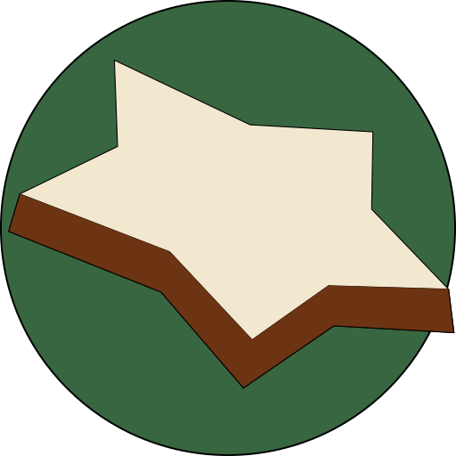

<p align="center"></p>

<h1 align="center">CStars</h1>

CStars is a CLI tool to interact with 'Advent of Code'. Its name is inspired by the traditional german christmas sweet, cinnamon stars, as well as the awesome phonetic.

## Usage

The `clap` crate generates an awesome help page, so try `cstars help`.

```
cstars 0.1.0
Lasse Haffke <lasse@haffke.me>
Interact with Advent of Code from the command-line

	USAGE:
		cstars [OPTIONS] <SUBCOMMAND>

	OPTIONS:
		-h, --help       Print help information
		-v, --verbose    Turn debugging information on
		-V, --version    Print version information

	SUBCOMMANDS:
		config    Print the used configuration
		get       Get a specific information for a date
		help      Print this message or the help of the given subcommand(s)
		submit    Submit an answer for a date

```

The main feature is the `get` subcommand. With this, the puzzle input, description and star count can be requested.

```
cstars-get
	Get a specific information for a date

	USAGE:
		cstars get <SUBCOMMAND>

	OPTIONS:
		-h, --help    Print help information

	SUBCOMMANDS:
		description    Get the description for a specific date
		help           Print this message or the help of the given subcommand(s)
		input          Get the input for a specific date
		star-count     Get the completed puzzle parts for a specific date
```

Each subcommand has different options, so make sure to use the help subcommand.

## Caching

All successful requests to the website are cached.
These includes all `get` requests and `submit` requests from the respective subcommands.

The cache can be found at the `config.cache_dir`. It is kept in plain text.

## Configuration

`CStars` allows for some configuration.
It uses the `directories` crate to discover the configuration file.
Check the crate's documentation for all valid [options](https://github.com/dirs-dev/directories-rs#projectdirs).
Append `cstars.toml` to the configuration directory determined by `directories` to get the final file location.

One possible example location on Linux system is `$HOME/.config/cstars/cstars.toml`.

### Possible configuration

Configuration options are:

| option                             | description                                                                                                                          | default                   |
| ---------------------------------- | ------------------------------------------------------------------------------------------------------------------------------------ | ------------------------- |
| `session_cookie_retrieval_command` | Advent of code requires a cookie to authenticate your account. To avoid storing it in clear text, put a command here to retrieve it. | `cat secret.txt`          |
| `cache_dir`                        | Directory to set up the caching in. If this directory is not writable `cstars` will panic!                                           | check `directories` crate |

## Contributing

This is my first major Rust project, so feel free to contribute anything via pull requests and issues.
